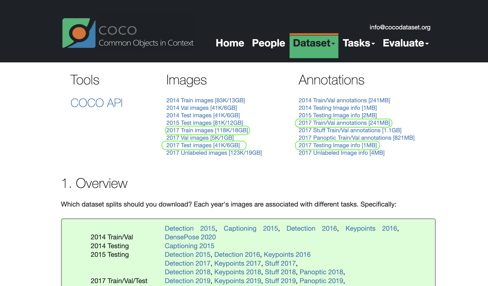

# Image-Captions-Generator
 

 

 

# Introduction

Inspired by the <a href="https://arxiv.org/pdf/1411.4555.pdf">Show and Tell: A Neural Image Caption Generator</a> paper, a neural network model was built and trained to extract features from the images and generate text captions. To facilitate model usage, a <strong>Web App</strong> was created and designed to allow users to upload image(s) to be captioned by the model. The captions generated can be downloaded in a CSV file including each image name and the generated caption. 

Moreover, the app makes it possible for interested users to train new models (rather than the pre-trained one provided in this repo).

# 🪄 Running the App

There are 2 options to use the images cations generator:

**Option 1:** Use the deployed app version in the [Link](https://zaidghazal-image-captions-generator-main-c583ik.streamlit.app). Note that the deployed version supports generating captions for the uploaded image(s) and downloading the results as a CSV file. These captions are generated using a pre-trained model. Training new models is not supported in this version.

**Option 2:** Clone/Download this repo file locally and run the app using the executable files. The one for macOS/Linux users is `run_macos.command`, or `run_windows.bat` for Windows. Using the local version, training a new model is available besides the captions generations as mentioned in option 1.

Bellow provided the instructions to run the app using both options.

## Option 1: Using the Deployed App

The deployed app can be accessed through the [Link](https://zaidghazal-image-captions-generator-main-c583ik.streamlit.app).

## Option 2: Using the App Locally
Alternatively, the repo files can be cloned/downloaded, and the app can be run using either files `run_macos.command` for macOS users, or `run_windows.bat` for Windows users. Images caption generation is available as in the deployed app. The extra feature is the ability to train a new model. This can be done by following these steps:

1- First, download the [COCO dataset](https://cocodataset.org/#download). Download only the files marked in green in the bellow picture:

2- Download/Clone the repo files locally. To do this step, eun the command:

<code>git clone https://github.com/ZaidGhazal/Image-Captions-Generator.git</code>

3- Create a new folder called `cocoapi` inside the downloaded/cloned repo local directory. Inside the created folder, also the `images` and `annotations` folders must be created. The two created folders should have the following paths:

images folder path: <code><PATH_TO_REPO/cocoapi/images></code>
annotations folder path: <code><PATH_TO_REPO/cocoapi/annotations></code>

4- After the COCO dataset files download is done, move the `train2017` and `test2017` folders into the created `images` folder (`cocoapi/images`). Also, move the content of the downloaded annotations folder (for the train and test sets) into the created annotations folder (`cocoapi/annotations`).

5- Run the suitable executable file (`run_macos.command` OR `run_windows.bat`) to start the app.

6- In the app, click on the `Train New Model` button to start training a new model. The training process may take a while depending on the machine's hardware. The trained model will be saved in the `models` folder. The trained model can be used to generate captions for new images.

7- After the training is done, click on the `Generate Captions` button to generate captions for the uploaded images. The generated captions can be downloaded as a CSV file by clicking on the `Download Captions` button.

*Note 1: the repo has the `models` folder containing pre-trained model files that can be used locally or through the deployed version. When a new model is trained locally, those files will be overwritten by the model files.*

*Note 2: to use GPU for training, a PyTorch version supporting CUDA must be installed in the python environment created by running the executable file. see [PyTorch Download Page](https://pytorch.org) for the pip command.*

# 🛕 Network Architecture

        The network architecture consists of two parts: The Encoder and Decoder.
        The Encoder consists of the pre-trained ResNet-50 model layers (except the last fully connected linear layer) and an embedding linear layer used to get the extracted features vector and produce the embedding vector in a configurable size.
        ResNet-50 was chosen due to its power in classifying objects, which makes it excellent in extracting complex features through its convolutional network. 
          
        The Decoder has three main parts: an embedding layer, an LSTM layer, and a fully connected output layer.
        The embedding layer is used to convert the input word indices to dense vectors of fixed size. The LSTM layer is a type of recurrent neural network that is used for processing sequential data. It has a configurable number of hidden states and a configurable number of layers. The fully connected output layer is used to generate the final caption.
          
        The deployed model has trained on the <a href="https://cocodataset.org/#home">COCO-2017</a> dataset. The training process was done on a machine equipped with a GeForce RTX 2080 Ti GPU. Training time was around 9 hours and 30 minutes. Training configurable parameters were as follows:
          
        <ul>
        <li>Batch Size: 256</li>
        <li>Vocabulary Threshold: 8</li>
        <li>Embedding Size: 300</li>
        <li>Hidden States Size: 256</li>
        <li>Learning Rate: 0.001</li>
        <li>Number of Epochs: 5</li>
        </ul>
        

# 🗂 Scripts and Directories

The repo contains the following scripts and directories:

- `app.py`: The main script to run the app. It contains the streamlit app structure and functionalities to generate captions and train new models.
- `model.py`: The script that contains the Encoder and Decoder PyTorch-based architecture definition.
- `train.py`: The script that contains the training functions.
- `data_loader.py`: The script that contains classes facilitating loading images in batches from the large COCO dataset and preparing the images for training/testing.
- `inference.py`: The script contains the class methods for running captions generation using the trained model.
- `vocabulary.py`: The script contains class methods for building dictionaries for converting tokens to integers.
- `run_macos.command`: The executable file to run the app on macOS.
- `run_windows.bat`: The executable file to run the app on Windows.
- `./models`: The directory contains the pre-trained model and the vocab files. This model is being used to serve the deployed version of the app.
- `./assets`: The directory contains the images used in this README file.

## 🌐 Socials:
--------------------
 

### ✍️ Random Dev Quote

---

<!-- Proudly created with GPRM ( https://gprm.itsvg.in ) -->

